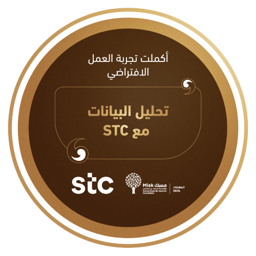

# STC Data Analysis Virtual Work Experiences 👨‍💻

## in this certfiation of Virtual Work Experiences with STC from [Misk](https://hub.misk.org.sa/programs/skills/virtual-work-experience-data-analysis-at-stc/)

#### Tasks 📩

-  I 've worked on  
- [analysis and visualize the data](<Task 1>)
-  bulding model [time predction](<task 2>) 
- Bulding model for [recommended system](<Task 3>) for users behavior.

